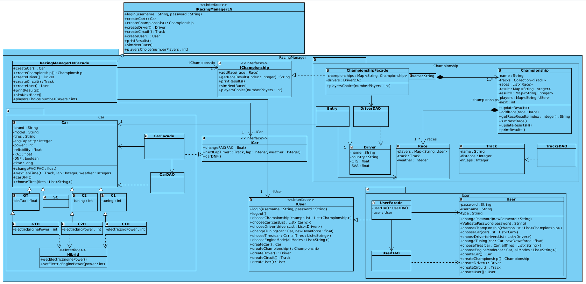

# Racing Manager

### Grupo 11

- Duarte Parente, A95844
- Gonçalo Pereira, A96849
- José Moreira, A95522
- Santiago Domingues, A96886

### Modelo de Domínio

### Diagrama de Use Case

### Diagrama de Componentes

### Diagrama de Classes

### Diagrama de Packages

### Diagramas de Sequência

#### Escolher Carro

#### Escolher Piloto

#### Escolher Pneus

#### Escolher modo Motor

#### Alterar afinação

